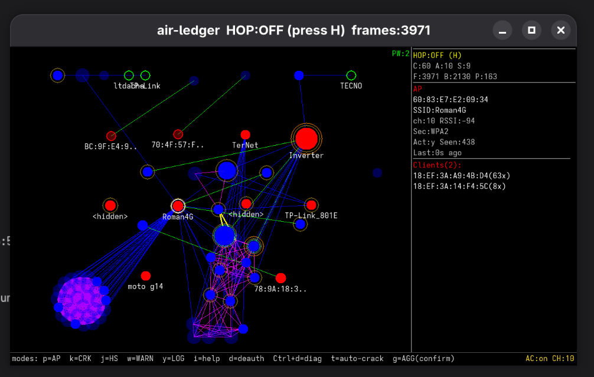

# air-ledger



`air-ledger` is an experimental utility for observing a Wi‑Fi environment, building a graph of devices and relationships, capturing WPA handshakes, attempting dictionary-based password recovery, and visually exploring what is happening in the air.

The project was never intended as a "serious industrial product". It was conceived more as:

- a toy for technical curiosity;
- a tool for studying Wi‑Fi networks and device behavior;
- a visual interface for experiments with monitor mode, deauth, hopping, handshake capture, and cracking;
- a separate experiment in human + LLM collaborative development.

## Important Note

This project is built as a research and learning tool. It may be useful for studying your own network, your own lab, your own hardware, and your own environment, but it is not positioned as a certified or guaranteed-safe solution.

Use it only where you have the right to do so.

## About Authorship and LLM

The author acted primarily as the lead: defining tasks, deciding program behavior, reviewing results, and telling the LLM what to do, where to adjust the code, and how the interface should behave.

This is not hidden and is part of the idea of the project itself. In a sense, that is also part of the game and the experiment:

- can a working tool be built through step-by-step technical guidance of an LLM;
- can an LLM be used not as "the author instead of the human", but as an executing engineering assistant;
- how far can interface design, logic, and behavior be pushed if the human remains the decision-maker.

So the project is simultaneously:

- a utility;
- a Wi‑Fi / monitor-mode playground;
- an experiment in human-led LLM development.

## Current Status

At the moment, the project is aimed at Linux systems only.

It has primarily been tested and tuned for:

- regular Linux desktop / workstation setups;
- BeePy OS;
- the ColorBerry device based on Raspberry Pi Zero 2 W.

In the future, the utility will likely be available:

- as a prebuilt standalone application;
- as part of BeePy OS;
- first of all for ColorBerry / Raspberry Pi Zero 2 W.

For now, all of this is distributed as is.

## Disclaimer

This project is distributed **as is**, without any guarantees:

- no guarantees of correctness;
- no guarantees of fitness for a particular purpose;
- no guarantees of compatibility with your hardware, drivers, distribution, Yocto build, or external tools;
- no claims against the author in case of breakage, crashes, incorrect behavior, data loss, driver issues, UI issues, or system problems.

If you run it on your system, you do so at your own risk and under your own responsibility.

## What the Program Can Do

At the current stage, `air-ledger` can:

- listen to Wi‑Fi traffic through an interface in monitor mode;
- build a graph of APs, clients, SSIDs, and relations;
- show activity, associations, and some anomalies;
- collect WPA handshakes;
- run dictionary-based password recovery on saved handshakes;
- use builtin CPU cracking, `aircrack-ng`, or `hashcat`;
- switch between desktop UI and compact UI for a small screen;
- work with overlay windows: AP list, crack queue, handshakes, event log, anomaly log, help;
- support deauth and inject diagnostics;
- show runtime events and messages in the log.

## External Tools

The program can use external system utilities:

- `iw`
- `aireplay-ng`
- `aircrack-ng`
- `hashcat`

By default, they are taken from the system through `PATH`.
If needed, the path can be overridden via CLI arguments:

- `--iw-bin`
- `--aireplay-bin`
- `--aircrack-bin`
- `--hashcat-bin`

## UI Profiles

The following profiles are supported:

- `auto` — normal desktop mode;
- `beepy` — fullscreen compact UI for BeePy / a small device;
- `beepy-window` — BeePy screen emulation in a normal desktop window for quick UI debugging without building firmware.

Example:

```bash
./air-ledger wlan0 --ui-profile beepy-window
```

## Basic Launch

Examples:

```bash
./air-ledger wlan0
./air-ledger wlan0 --db session.db
./air-ledger wlan0 --capture-dir ./caps --wordlist ./wl.txt
./air-ledger capture.pcapng --ui-profile beepy-window
```

## Keyboard Layout

### General Keys

- `Left click` — select a node
- `Middle drag` — move the camera
- `Scroll`, `z`, `x` — zoom
- `Arrow keys` — move the camera
- `0` — fit the graph to the screen
- `Tab / Shift+Tab` — cycle AP nodes on the graph
- `Ctrl+Tab / Ctrl+Shift+Tab` — circular scroll of the right sidebar
- `Esc` — clear selection / close current overlay
- `i` — help
- `q` — quit

### Air / Interface Control

- `h` — enable / disable channel hopping
- `+ / -` — change hopping dwell time
- `d` — send deauth to the selected AP
- `Ctrl+d` — inject / deauth diagnostics
- `g` — aggressive mode
- `Ctrl+r` — reset the Wi‑Fi interface

### Cracking Control

- `t` — enable / disable auto-crack for new handshakes
- `k` — open `CRACK QUEUE`
- `j` — open `HANDSHAKES`

### Filters and Data

- `f` — active-node filter
- `r` — randomized-MAC filter
- `o` — probe-only client filter
- `a` — set alias for the selected node
- `c` — collapse / expand AP group
- `/` — search
- `e` — export JSON

### Overlay Windows

All main overlays follow the same control style:

- `Up / Down` — move through the list
- `Tab / Shift+Tab` — also move through the list
- `Ctrl+Tab / Ctrl+Shift+Tab` — scroll the right sidebar
- `Enter` — select an item, when the overlay supports selection
- `Esc` or the same key that opened the overlay — close the overlay

Windows:

- `p` — `AP LIST`
- `k` — `CRACK QUEUE`
- `j` — `HANDSHAKES`
- `w` — `ANOMALY LOG`
- `y` — `EVENT LOG`
- `i` — `HELP`

## What the Graph Markings Mean

### Node Types

- `blue` — client device
- `red / yellow AP marker` — access point
- `green` — known SSID
- `purple / ghost SSID` — an SSID that was mentioned but not confirmed by a beacon from an AP

### Rings and Markers

- `cyan ring` — the client participated in a captured WPA handshake
- `orange ring` — the node has an anomaly / event
- `purple ring` — the client was seen at more than one AP
- `gold ring` — the device looks stationary / regularly present
- `white outline` — the selected node

### AP Markers

- `[pw]` / a password in AP info — password found
- `X` on an AP — cracking finished without success / password not found
- `crack running` — this AP currently has an active or queued cracking job

### Graph Edges

- `AssociatedWith` — the client is associated with an AP
- `Broadcasts` — the AP broadcasts an SSID
- `ProbesFor` — the client probes / searches for an SSID
- `SeenNear` — nodes were seen near each other
- `SimilarTo` — client similarity
- `FingerprintMatch` — radio fingerprint match

## What the Interface Labels Mean

### Top / Bottom of the Screen

- `PW:N` — how many passwords have already been found
- `AC:on/off` — whether auto-crack is enabled
- `CH:N` — the actual interface channel

### Right Sidebar

The right sidebar shows information about the currently selected item or the item highlighted in an overlay list.

It may show:

- BSSID / MAC
- SSID
- vendor
- security
- channel
- alias
- fingerprints
- crack state
- recovered passwords
- anomaly count
- related APs / clients / SSIDs

### `CRACK QUEUE` Window

Shows:

- which AP is currently in the queue
- how many handshakes were captured
- whether cracking is running
- which backend is actually being used
- whether a password was found
- whether a fallback from GPU to CPU happened

### `EVENT LOG` Window

This window collects:

- toast messages;
- runtime notices;
- warnings;
- errors;
- cracking events;
- service / UI messages.

Repeated messages are collapsed.

### `ANOMALY LOG` Window

Shows registered anomalies, for example:

- deauth flood;
- probe / auth flood;
- unexpected deauth;
- evil-twin-like observations.

## What It May Be Useful For

The project may be useful for:

- studying the behavior of your home network;
- Wi‑Fi experiments on embedded Linux;
- debugging monitor mode / hopping / deauth / capture;
- educational demonstrations;
- a compact visual interface for a small screen;
- exploring how an LLM can be used in the development of an engineering tool.

## What Is Not Here Yet

You should not expect:

- full stability on any adapter;
- perfect compatibility with all drivers;
- production-grade quality;
- identical behavior on all Linux / Yocto systems;
- complete protection from edge cases in capture / deauth / cracking.

## Practical Notes

- Live capture requires Linux and working monitor mode.
- Deauth and inject behavior depends heavily on the adapter and driver.
- `hashcat` requires a working runtime / driver / GPU backend.
- Do not leave runtime garbage inside the git repository if you use `externalsrc` in Yocto.
- For quick desktop debugging of the compact UI, use `--ui-profile beepy-window`.

## Plans

Likely future directions:

- more compact UI polishing;
- better behavior on very small screens;
- further cracking/debug work on embedded Linux;
- prebuilt application releases;
- delivery as part of BeePy OS;
- more tuning for ColorBerry / Raspberry Pi Zero 2 W.

---

If you want a strict finished product, this is not it yet.
If you want a living technical experiment, a visual Wi‑Fi playground, and a human-led LLM development workflow, this is exactly that.
